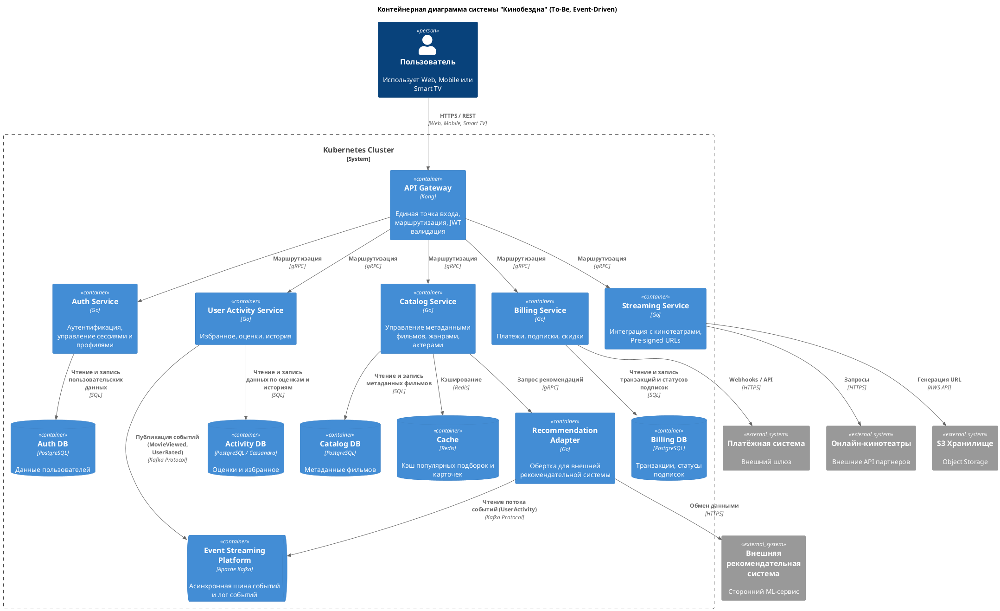

```puml
@startuml
!include <C4/C4_Container>

title Контейнерная диаграмма системы "Кинобездна" (To-Be, Event-Driven)

Person(user, "Пользователь", "Использует Web, Mobile или Smart TV")

System_Boundary(k8s, "Kubernetes Cluster") {
    Container(api_gw, "API Gateway", "Kong", "Единая точка входа, маршрутизация, JWT валидация")
    
    Container(auth_svc, "Auth Service", "Go", "Аутентификация, управление сессиями и профилями")
    ContainerDb(auth_db, "Auth DB", "PostgreSQL", "Данные пользователей")
    
    Container(catalog_svc, "Catalog Service", "Go", "Управление метаданными фильмов, жанрами, актерами")
    ContainerDb(catalog_db, "Catalog DB", "PostgreSQL", "Метаданные фильмов")
    ContainerDb(catalog_cache, "Cache", "Redis", "Кэш популярных подборок и карточек")
    
    Container(billing_svc, "Billing Service", "Go", "Платежи, подписки, скидки")
    ContainerDb(billing_db, "Billing DB", "PostgreSQL", "Транзакции, статусы подписок")
    
    Container(activity_svc, "User Activity Service", "Go", "Избранное, оценки, история")
    ContainerDb(activity_db, "Activity DB", "PostgreSQL / Cassandra", "Оценки и избранное")
    
    Container(streaming_svc, "Streaming Service", "Go", "Интеграция с кинотеатрами, Pre-signed URLs")
    
    Container(rec_adapter, "Recommendation Adapter", "Go", "Обертка для внешней рекомендательной системы")
    
    ContainerQueue(kafka, "Event Streaming Platform", "Apache Kafka", "Асинхронная шина событий и лог событий")
}


System_Ext(payment_sys, "Платёжная система", "Внешний шлюз")
System_Ext(online_cinemas, "Онлайн-кинотеатры", "Внешние API партнеров")
System_Ext(rec_sys, "Внешняя рекомендательная система", "Сторонний ML-сервис")
System_Ext(s3, "S3 Хранилище", "Object Storage")

Rel(user, api_gw, "HTTPS / REST", "Web, Mobile, Smart TV")

Rel(api_gw, auth_svc, "Маршрутизация", "gRPC")
Rel(api_gw, catalog_svc, "Маршрутизация", "gRPC")
Rel(api_gw, billing_svc, "Маршрутизация", "gRPC")
Rel(api_gw, activity_svc, "Маршрутизация", "gRPC")
Rel(api_gw, streaming_svc, "Маршрутизация", "gRPC")

Rel(auth_svc, auth_db, "Чтение и запись пользовательских данных", "SQL")

Rel(catalog_svc, catalog_db, "Чтение и запись метаданных фильмов", "SQL")
Rel(catalog_svc, catalog_cache, "Кэширование", "Redis")

Rel(billing_svc, billing_db, "Чтение и запись транзакций и статусов подписок", "SQL")
Rel(billing_svc, payment_sys, "Webhooks / API", "HTTPS")

Rel(activity_svc, activity_db, "Чтение и запись данных по оценкам и историям", "SQL")
Rel(activity_svc, kafka, "Публикация событий (MovieViewed, UserRated)", "Kafka Protocol")

Rel(streaming_svc, s3, "Генерация URL", "AWS API")
Rel(streaming_svc, online_cinemas, "Запросы", "HTTPS")

Rel(rec_adapter, kafka, "Чтение потока событий (UserActivity)", "Kafka Protocol")
Rel(rec_adapter, rec_sys, "Обмен данными", "HTTPS")
Rel(catalog_svc, rec_adapter, "Запрос рекомендаций", "gRPC")

@enduml
```